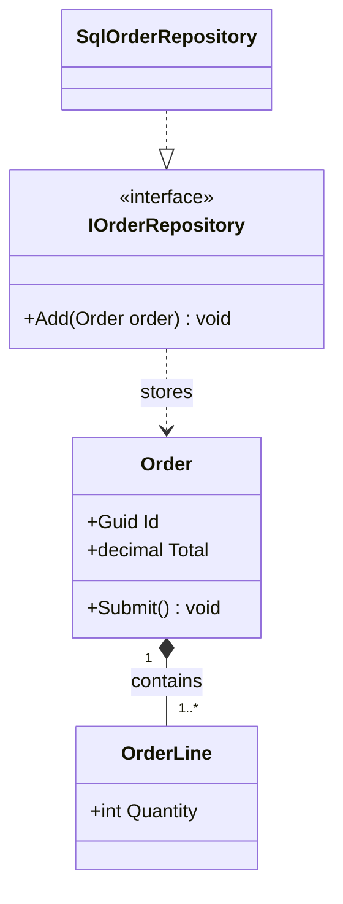

# Modeling UML

**Best model:** Plan tier (Claude Sonnet 5.5) via the Planner. Writing the diagram file is mechanical and works on Quick tier (GPT-6 Luna).

UML is a thinking tool: one diagram, one question, the right level of detail.

## Pick the type by the question

| Question | UML type | Draw in |
|----------|----------|---------|
| What are the types and how are they related? | Class | Mermaid `classDiagram` or draw.io |
| How do parts of the system connect? | Component | draw.io |
| Where does it run? | Deployment | draw.io |
| Who uses the system for what? | Use case | draw.io |
| What happens in order for one scenario? | Sequence | Mermaid `sequenceDiagram` |
| What states can an entity be in? | State | Mermaid `stateDiagram-v2` |
| How does a process branch and flow? | Activity | Mermaid `flowchart` |

Choose Mermaid for quick, versioned, in-Markdown diagrams (see `writing-mermaid`). Choose draw.io for
polished, hand-editable diagrams (see `designing-diagrams`).

## Workflow

```
UML progress:
- [ ] 1. State the question and the audience
- [ ] 2. Choose the type and the scope (which classes, which scenario)
- [ ] 3. Gather facts from code, not memory
- [ ] 4. Draw at one abstraction level
- [ ] 5. Review against the checks below
```

**Gather facts.** Read the actual types. For a class diagram, take attributes from fields and
properties, operations from public methods, and relationships from field and parameter types. Do not
invent members.

## Notation

| Element | Notation |
|---------|----------|
| Visibility | `+` public, `-` private, `#` protected, `~` package |
| Interface | `<<interface>>` stereotype |
| Abstract class | italic name or `<<abstract>>` |
| Multiplicity | `1`, `0..1`, `*`, `1..*` at each end |

Relationships (Mermaid syntax):

- Inheritance, is-a: `Parent <|-- Child`
- Realization, implements: `Impl ..|> IFace`
- Association, knows about: `A --> B`
- Aggregation, has, parts live on: `Whole o-- Part`
- Composition, owns, parts die with the whole: `Whole *-- Part`
- Dependency, uses briefly: `A ..> B`

## Checks before finishing

- One purpose per diagram; 15 elements or fewer, otherwise split by module or aggregate.
- Show only members that explain the design: skip getters, setters, and framework plumbing.
- Names come from the domain, not from implementation details.
- Every arrow has a meaning you can say in one sentence; label non-obvious ones.
- Domain and Application types appear before Infrastructure; dependencies point inward.
- Sequence diagrams show one scenario (happy path, plus at most one `alt`).

## Example (Mermaid class)


