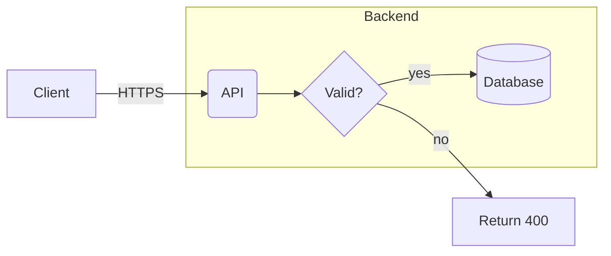
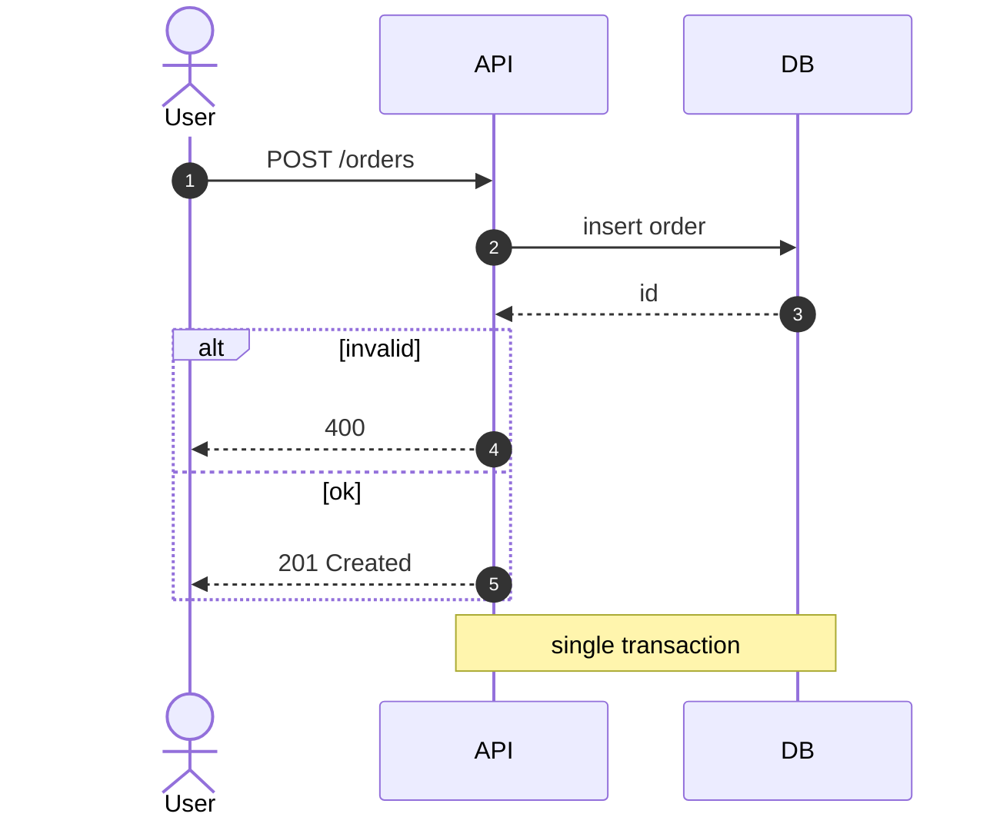
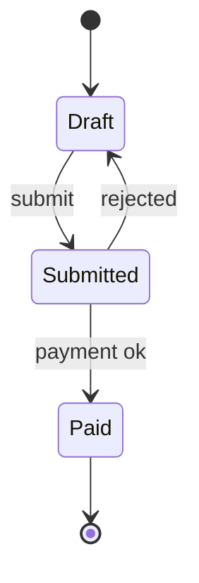
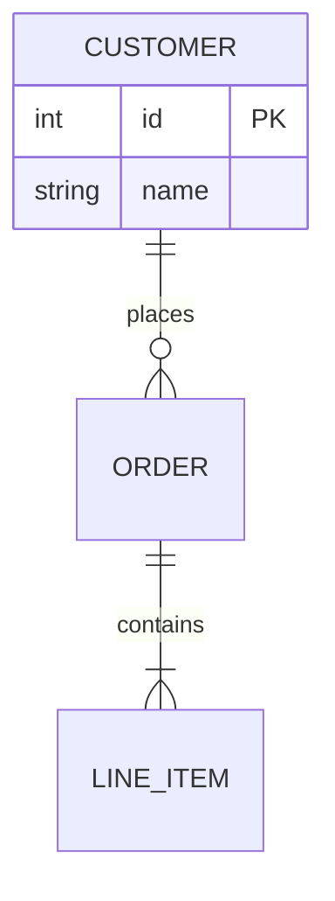

# Writing Mermaid

**Best model:** Quick tier (GPT-6 Luna) via Quick Helper for a single diagram; Plan tier (Claude Sonnet 5.5) when the diagram needs design thinking.

Put each diagram in a fenced block tagged `mermaid` inside a Markdown file (for example
`docs/architecture.md`). It renders in the VS Code preview (extension `bierner.markdown-mermaid`) and on GitHub.

## Choose the type

| Need | Start with |
|------|------------|
| Process, pipeline, architecture sketch | `flowchart LR` or `flowchart TD` |
| Request flow between services | `sequenceDiagram` |
| Types and relations | `classDiagram` (see `modeling-uml`) |
| Lifecycle of an entity | `stateDiagram-v2` |
| Database tables | `erDiagram` |
| Schedule or phases | `gantt` |
| Brainstorm tree | `mindmap` |
| System context and containers | `C4Context` / `C4Container` (experimental syntax) |

## Syntax essentials

Flowchart shapes: `[rect]`, `(rounded)`, `{decision}`, `[(database)]`, `((circle))`. Edges: `-->`, `---`,
`-.->` (dotted), `==>` (thick), label with `-->|text|`. ER cardinality: `||` one, `o|` zero or one,
`o{` zero or many, `|{` one or many.

## Avoid the common errors

- Quote labels containing parentheses, brackets, colons, or quotes: `A["Save (draft)"]`.
- Keep ids simple (`api`, `db1`), no spaces; put the display text in the brackets.
- Do not use the word `end` as a node id or lowercase label; write `End` or `"end"`.
- One statement per line; indent consistently; comments start with `%%`.
- Declare `participant` and `actor` first in sequence diagrams so the order is the one you want.
- Keep to about 25 nodes. Split larger diagrams by subgraph or by scenario.
- Use `direction` consistently: `LR` for pipelines, `TD` for hierarchies.

## Workflow

1. Pick the type from the table and write the smallest diagram that answers the question.
2. Save it in the target Markdown file.
3. Check the rules above, then open the Markdown preview to confirm it renders. If you can run
   Node, `npx -y @mermaid-js/mermaid-cli -i file.mmd -o out.svg` also validates syntax.
4. If it fails to render, fix the first reported error before changing anything else.
